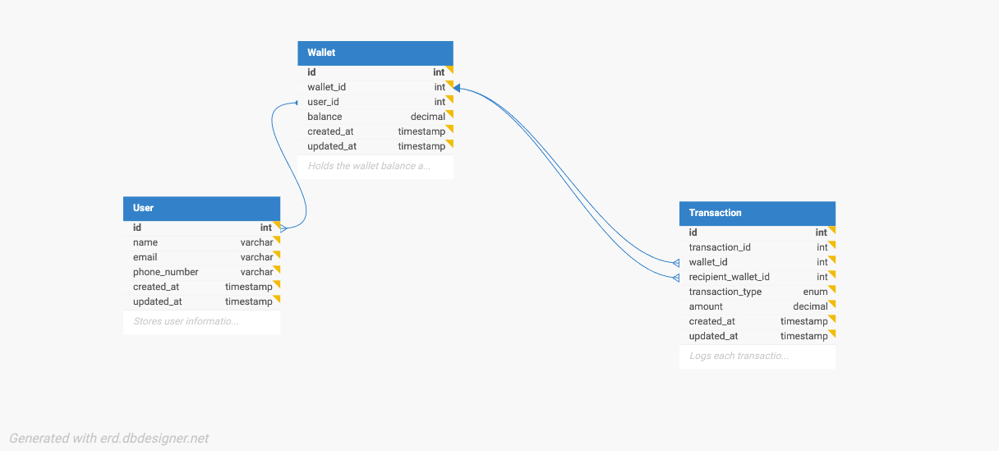

# Demo Credit Wallet Service

This project is a backend service for a mobile lending application that provides wallet functionality for borrowers. It allows users to create accounts, fund their wallets, transfer funds, and withdraw funds, while integrating with the Lendsqr Adjutor Karma blacklist service to prevent restricted users from onboarding.

## Features

- User account creation
- Wallet funding
- Fund transfers between accounts
- Withdrawals from accounts
- Lendsqr Adjutor Karma blacklist integration

## Tech Stack

- Node.js (LTS)
- TypeScript
- Knex.js (SQL query builder)
- MySQL

## Getting Started

### Prerequisites

- Node.js (LTS version)
- MySQL database

### Installation

1. Clone the repository:

   ```bash
   git clone https://github.com/macbrina/demo-credit-wallet-service.git
   cd demo-credit-wallet-service

   ```

2. Install dependencies:

   ```bash
   npm install

   ```

3. Set up environment variables in a .env file:

   ```makefile
   DB_HOST=localhost
   DB_USER=your_db_user
   DB_PASSWORD=your_db_password
   DB_NAME=your_db_name

   ```

4. Run the application

   ```bash
   npm run dev
   ```

### Database ER Diagram

Below is the E-R diagram representing the database schema for the wallet service:



### License

This project is licensed under the MIT License - see the [LICENSE](LICENSE) file for details.
