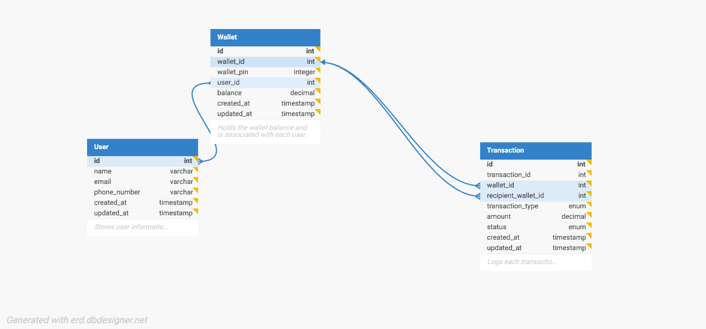

# Demo Credit Wallet Service

This project is a backend service for a mobile lending application that provides wallet functionality for borrowers. It allows users to create accounts, fund their wallets, transfer funds, and withdraw funds, while integrating with the Lendsqr Adjutor Karma blacklist service to prevent restricted users from onboarding.

## Table of Contents

- [Features](#features)
- [Tech Stack](#tech-stack)
- [Getting Started](#getting-started)
  - [Prerequisites](#prerequisites)
  - [Installation](#installation)
  - [Running the Application](#running-the-application)
  - [Running Unit Tests](#running-unit-tests)
- [API Documentation](#api-documentation)
- [Database ER Diagram](#database-er-diagram)
- [License](#license)

## Features

- User account creation
- Wallet funding
- Fund transfers between accounts
- Withdrawals from accounts
- View wallet balance
- View all transactions
- View transaction by transaction id
- Lendsqr Adjutor Karma blacklist integration

## Tech Stack

- Node.js (LTS): A JavaScript runtime built on Chrome's V8 JavaScript engine.
- TypeScript: A typed superset of JavaScript that compiles to plain JavaScript.
- Knex.js: A SQL query builder for Node.js, facilitating database operations.
- MySQL: A relational database management system.

## Getting Started

### Prerequisites

- Node.js: Ensure you have the LTS version installed.
- MySQL: Have a MySQL database set up and running.

### Installation

1. Clone the repository:

   ```bash
   git clone https://github.com/<your-username>/demo-credit-wallet-service.git
   cd demo-credit-wallet-service

   ```

2. Install dependencies:

   ```bash
   npm install

   ```

3. Set up environment variables in a .env file:

   ```makefile
   PORT=3000
   DB_HOST=localhost
   DB_USER=<db_username>
   DB_PASS=<db_password>
   DB_PORT=<db_port>
   NODE_ENV=development
   DB_NAME=<db_database_username>
   JWT_SECRET_KEY=<your_jwt_secret>
   LENDSQR_API_URL=https://adjutor.lendsqr.com/v2
   LENDSQR_SECRET_KEY=<your_lendsqr_secret_key>

   ```

4. Run the application:
   ```bash
   npm run dev
   ```

### Running the Application

To start the application, ensure your database is running, and execute the following command in your project directory:

```bash
npm run dev
```

This will start the server on the specified port (default is 3000). You can use Postman or other API testing tools to interact with the endpoints. Please refer to the API documentation for detailed information. The TypeScript files are compiled into the dist folder, which can be customized in the tsconfig.json file.

### Running Unit Tests

To ensure the integrity of your codebase, this project uses Jest for unit testing. To run the tests, follow these steps:

1. Ensure Jest is Installed: Jest should be included in your package.json. If it's not, you can add it by running:

   ```bash
   npm install --save-dev jest @types/jest ts-jest supertest
   ```

2. Run the Tests: You can run the unit tests by executing:

   ```bash
   npm test

   ```

## API Documentation

The API endpoints for this service can be accessed at the following base URL:

- Base API URL: https://documenter.getpostman.com/view/29459580/2sAY4xA25n

Here are some of the main endpoints:

- User Registration: POST /users/register
- User Login: POST /users/login
- Wallet Funding: POST /wallets/:wallet_id/deposit
- Wallet Transfer: POST /wallets/:recipient_wallet_id/transfer
- Wallet Withdraw: POST /wallets/:wallet_id/withdraw
- Get Wallet Balance: GET /wallets/:wallet_id/balance
- Get Transaction History: GET /transactions/:wallet_id/all
- Get Transaction Details: GET /transactions/:transaction_id

## Database ER Diagram

Below is the E-R diagram representing the database schema for the wallet service:



## License

This project is licensed under the MIT License - see the [LICENSE](LICENSE) file for details.
